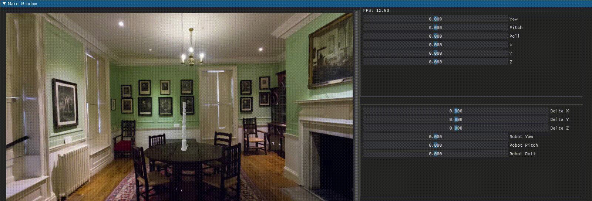

# 3DGS RobotArm

## RobotArm
```bash
bash run.sh
```
## GUI Display:
After setting up the GUI, you can see the following interface:



## Pretrained Model

[Google Cloud](https://drive.google.com/drive/folders/1i5MQjr780SM5AvRjba7u5GsSy95KyvDq?usp=sharing)


## Release Note

### 20240829 
* Add mesh export and physical engine characteristics
* Add 2dgs convert option
* Support rm65 robot arm 
* Add remote simulation support 


