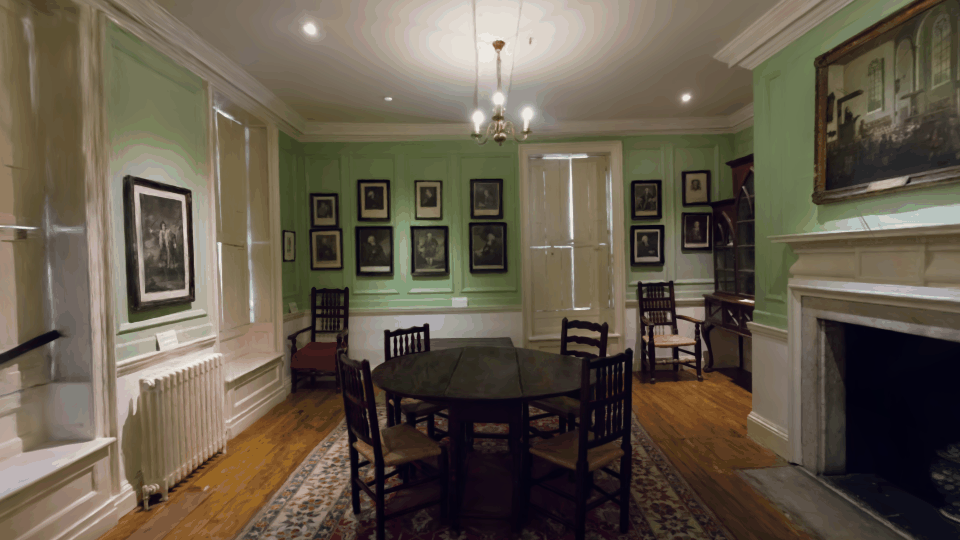
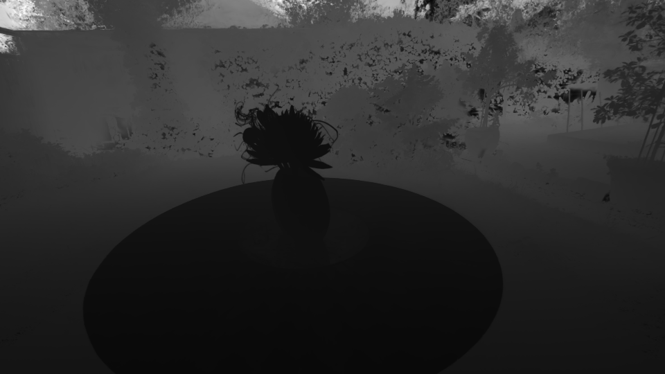
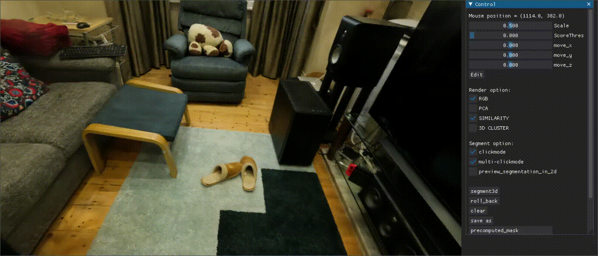
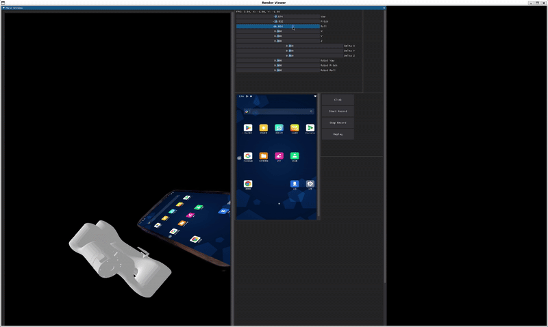

# 3DGS RobotArm

## RobotArm
```bash
bash run.sh
```
## GUI Display:
After setting up the GUI, you can see the following interface:

<table>
<tr>
<td></td>
</tr>
</table>

## Release Note

### 20240829 
* Add mesh export and physical engine characteristics
* Add 2dgs convert option
* Support rm65 robot arm 
* Add remote simulation support

### 20240913
* Add Depth Results (cumulative opacity)
* Support move delete Add operation

<table>
<tr>
<td></td>
<td></td>
</tr>
</table>

### 20240924
* Add [GUI](saga_gui.py) for editing gaussian splatting scenes
* Adapt more training scenes

<table>
<tr>
<td></td>
</tr>
</table>

### 20241011
* Add FlashGS, improve fps 50% [3dgs_viewer_flashgs.py](3dgs_viewer_flashgs.py) compared with vanilla 3dgs [3dgs_viewer.py](3dgs_viewer.py)
* Add item buttom in edit mode

### 20241113
* Add rebot simulation 

#### Instructions for use are given below
* Connect an Android device or start an Android virtual machine. Ensure that devices can be found properly using `adb devices`
* run `python android_control/server.py`. What it does is turn on a feature that hijacks the Android screen and processes it with OpenCv lib.
* run `python simulate_touch.py --model_path model_file/3dgs/phone` to steup a simulation environment for rebotarm, you can control it for phone click or other behaviour.
* The Android screen is displayed in real time in a virtual environment. A video example will be shown.

<table>
<tr>
<td></td>
</tr>
</table>


